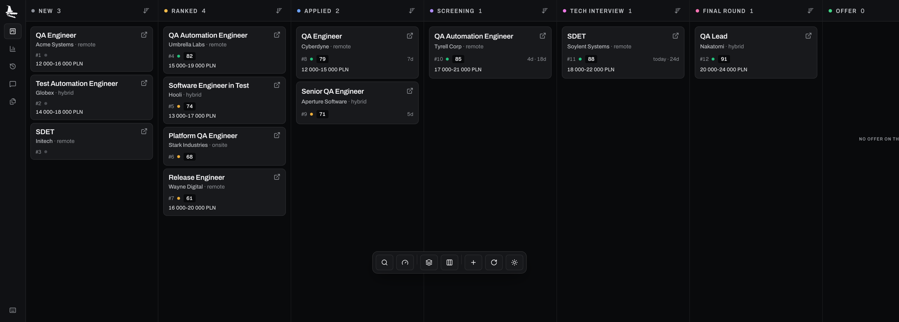

# Croc the Job

<p align="center">
  
</p>

<p align="center">
  <em>Most of a job search is paperwork you redo for every posting.</em><br>
  <strong>Croc the Job scrapes the boards, scores postings against your profile, drafts the CV, and keeps the lot in one JSON file you own.</strong><br>
  <em>Local-first. Open source.</em>
</p>

<p align="center">
  <a href="https://claude.com/claude-code"></a>
</p>

---

<p align="center">
  
</p>

<p align="center"><strong>Scrape · Rank · Tailor · Track · Prep</strong></p>

<p align="center">
  <sub>One JSON file, read and written by both halves</sub><br>
  
  
  
  
  
  <br>
  <a href="https://github.com/fn-jakubkarp/crocthejob/actions/workflows/ci.yml"></a>
  
  <a href="LICENSE"></a>
  
</p>

A few dozen applications in, the part that breaks is record keeping. Did I already see this one. Did they ever reply. What does the CV they are about to interview me on actually say. The skills do the writing, the board keeps the record, and both work on the same file.

The skills scrape the portals, score what came back against your profile, and draft a CV that only says things you can defend. The board is where you drag a card from **applied** to **screening** and the JSON updates underneath.

> [!NOTE]
> Every document it writes is assembled out of `documents/` and nothing else. It will not invent a skill you did not list or a number you did not give it. A thin profile produces a generic CV, and no amount of prompting fixes that.

## Features

- **Deduped scraping**: `/scrape` runs every installed portal CLI and compares URLs canonically, so the same posting under `?utm_source=` and a locale prefix is one entry, not three. Postings expire; the fetched text is saved to `documents/postings/` before it does.
- **Ranking with the reasons attached**: `/rank` batch-scores new postings on five dimensions with parallel agents, vetoes on your stated deal-breakers, and hands back a shortlist with honest per-job gaps. Location is stored as the place the posting names, never as a verdict that throws the place away.
- **A CV you can defend in the interview**: `/apply` drafts, then a second agent with a fresh context researches the company and critiques the draft, then it revises. Every claim is audited against your profile before the file is written; gaps stay visible and are never stuffed.
- **Tailoring by subtraction**: one master CV, kept deliberately over-length. Per application it is cut and reordered, never rewritten, so nothing drifts. When it overflows a page, lines are scored by relevance to *this* posting and the lowest goes first.
- **The board**: nine columns over the same JSON, drag to change status, notes save to the entry. Plus a stats page, a history timeline, a docs reader and a chat pane wired to your local Claude Code.
- **Outcomes kept separate from status**: `rejected` absorbs every way an application ends, and *how* it ended is a combinable `outcome` array. Going quiet after the technical is `["ghosted", "failed_tech"]`, which three separate columns could never have said.
- **Calibrated on your own funnel**: `/outcome` records what happened and `/setup` folds it back into the scoring framework, so the ranking calibrates on which roles actually converted for you.
- **Portals for your own market**: three Polish portals ship, LinkedIn and freehire are market-agnostic, and `/add-portal` scaffolds a skill for any other board and test-runs it live before registering.

## Prerequisites

- [Claude Code](https://claude.com/claude-code): drives everything. The portal skills also work from Codex, OpenCode and the Gemini CLI (see [`AGENTS.md`](AGENTS.md)).
- [Bun](https://bun.sh): the portal CLIs and the web app.
- Python 3.10+: the lint and guard scripts.
- Optional, [`pdftotext`](https://poppler.freedesktop.org/): `/apply` uses it to check your exported PDF the way an ATS reads it. Without it the check degrades to a visual review.

## Installation

```bash
git clone https://github.com/fn-jakubkarp/crocthejob.git
cd crocthejob
bun install
```

The repo root is a bun workspace covering the web app and all five portal CLIs, so that one install
does everything. Same command on Windows.

<details>
<summary>Verify the install</summary>

```bash
python3 tools/lint_skills.py                      # needs pyyaml
python3 tools/security_guards.py
python3 -m unittest discover -s tests -t .
bun run ci && bun run test
```

</details>

## First, fill in your documents

`documents/templates/` holds three starters. Copy each into place and write it. This is the step that decides output quality, and it is the one people skip.

| Template | Goes to | What it is |
| --- | --- | --- |
| `master_cv.md` | `documents/cv/master_cv.md` | The one strong CV every tailored version is cut from |
| `linkedin-profile.md` | `documents/linkedin/Profile.md` | What your profile says today, recommendations included |
| `professional-record.md` | `documents/references/professional-record.md` | The long-form private account of what you actually did |

> [!IMPORTANT]
> The professional record is the one worth the evening. A CV bullet holds eight words about six months of work; an interview answer needs the situation, the constraint and the outcome that the bullet dropped. Write it messy, ask Claude to sort it out, come back to it. It gets written several times, not once.

## Usage

Open Claude Code **inside the repo** and run the skills. The loop is: profile once, then scrape, rank, apply, record.

```
/setup                                  # turn documents/ into your profile
/scrape                                 # search every installed portal, dedupe
/rank                                   # score what came back, shortlist it
/apply <url or pasted posting text>     # evaluate, draft, review, revise, verify
/outcome                                # record what happened
```

### Commands

**Profile**

| Command | What it does |
| --- | --- |
| `/setup [--section <name>]` | Builds your profile from `documents/`, a pasted CV, or an interview. Re-runnable; it merges and asks before overwriting. `--section search` re-runs just the search config. |
| `/expand` | Enriches the profile from public sources you already linked in it: repos, portfolio, course syllabi. Discovered competencies land with a source tag. |
| `/reset [profile\|documents\|all]` | Wipes profile data or the documents folder. Shows exactly what goes and makes you type `RESET`. |

**Find**

| Command | What it does |
| --- | --- |
| `/scrape [focus]` | Runs every enabled portal CLI, dedupes against everything ever seen, saves posting text, presents matches sorted by fit. `/scrape health` probes the portals instead of searching. |
| `/rank [--all]` | Batch-scores new postings against the fit framework in parallel, vetoes on deal-breakers, flags deadlines, marks dead postings expired. Pick a number and it hands off to `/apply`. |
| `/add-portal` | Investigates a job board in your market, scaffolds a CLI skill with the same output contract as the shipped ones, and test-runs a live query before registering it. |

**Apply**

| Command | What it does |
| --- | --- |
| `/apply {url \| text}` | The drafter-reviewer workflow: evaluate fit, draft the tailored CV, spawn a reviewer with a fresh context to research the company and critique it, revise, verify against the profile, ATS-check the keywords. |
| `/outcome [followup]` | Records interview stages, offers, rejections and silence; archives the CV and posting. `followup` surfaces applications gone quiet and drafts a short note, never sends one. |
| `/interview {company}` | Builds a stage-specific prep pack from that application's own archive: the posting, the CV they actually read, feedback from earlier rounds. Offers a mock interview. |
| `/upskill [url]` | The gap between your profile and your tracked postings, as a prioritized heatmap plus a learning plan with time estimates. |

> [!TIP]
> A posting URL that will not fetch is not a dead end: `/apply <the full job description>` takes pasted text, and the board's **Save posting** dialog files it where `/scrape` would have.

## The board

```bash
bun run dev        # http://localhost:5173
```

Drag a card and the entry's `status` is rewritten in `data/jobs.json`. Notes typed on a card save to the same entry. Five sections: the board, stats, a history timeline, a markdown docs reader, and a chat pane that talks to the same Claude Code install your terminal does.

> [!WARNING]
> It runs under `bun run dev` only. The write path is a Vite dev-server plugin, so `bun run build` produces a bundle that loads nothing and saves nothing. This is a local tool, not a deployment.

The data file does not have to live in the repo. `studio/packages/jobs-data/store.ts` checks `JOBS_FILE`, then `../data/jobs.json` next to `studio/`, then `studio/data/jobs.json`, first hit wins.

```bash
JOBS_FILE=~/jobs.json bun run dev
```

## How it works

**One file, two halves.** `data/jobs.json` is keyed by posting URL. `/scrape` appends, `/rank` scores into it, the board moves cards around it, `/outcome` closes them out. There is no database and no sync, which is why the board and the skills never disagree about what happened.

**Field ownership is explicit.** Six fields belong to the board alone (`id`, `next_id`, `status_date`, `applied_date`, `duplicate_of`, `outcome`), and the skills are told to carry them through untouched. `studio/packages/jobs-data/` is the only code that opens the file, so the schema has one definition rather than four.

**Statuses are a pipeline, outcomes are a description.**

```
new → ranked → applied → screening → tech_interview → final_round → offer
                                                    ↘ rejected · skipped
```

**Nothing is fabricated.** Three sources ground every draft: `01-candidate-profile.md`, the master CV, and the profile block in `CLAUDE.md`. A claim supported by none of them is removed before the file is written, which is also why a fact you confirm in conversation gets written back to the profile in the same turn.

## Repo layout

```
crocthejob/
├── CLAUDE.md                      # your profile + the workflow rules (template until /setup)
├── AGENTS.md                      # thin pointer for non-Claude agent runtimes
├── data/jobs.json                 # every posting seen, every application made
├── .claude/
│   ├── commands/                  # the ten slash commands above
│   ├── skills/
│   │   ├── job-application-assistant/   # profile, writing style, evaluation, CV rules, interview prep
│   │   ├── job-scraper/                 # /scrape orchestration + your search queries
│   │   └── upskill/
│   └── settings.json              # the pre-approved permission allowlist
├── .agents/skills/                # portal search CLIs (Bun, one SKILL.md each)
├── documents/                     # your CV, LinkedIn, references, applications + templates/
├── studio/                        # the web app and the code it shares
│   ├── apps/web/                  # board, stats, history, docs, chat (Vite + React)
│   ├── packages/jobs-data/        # the schema, and the only code that opens jobs.json
│   └── brand/                     # the marks
├── tools/                         # lint_skills.py, security_guards.py, verify_pdf.py
└── tests/
```

## Contributing

Issues and PRs welcome. Run the four checks in **Verify the install** above before opening one.

Market-specific portal skills belong in your own fork rather than here, which is what `/add-portal` is for. Improvements to the generator itself are very welcome.

## Credits

Forked from [MadsLorentzen/ai-job-search](https://github.com/MadsLorentzen/ai-job-search) (MIT), then rewritten: Polish-market portals, a web app, one data file instead of two, a markdown CV pipeline, and its own opinions about what a job search needs. The portal-CLI pattern traces back to [Mikkel Krogholm](https://github.com/mikkelkrogsholm)'s [skills repo](https://github.com/mikkelkrogsholm/skills).

Built with [Claude Code](https://claude.com/claude-code).

## License

MIT. See [LICENSE](LICENSE).
