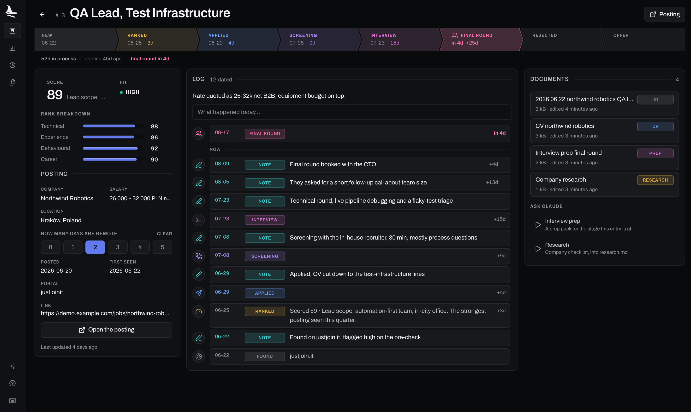
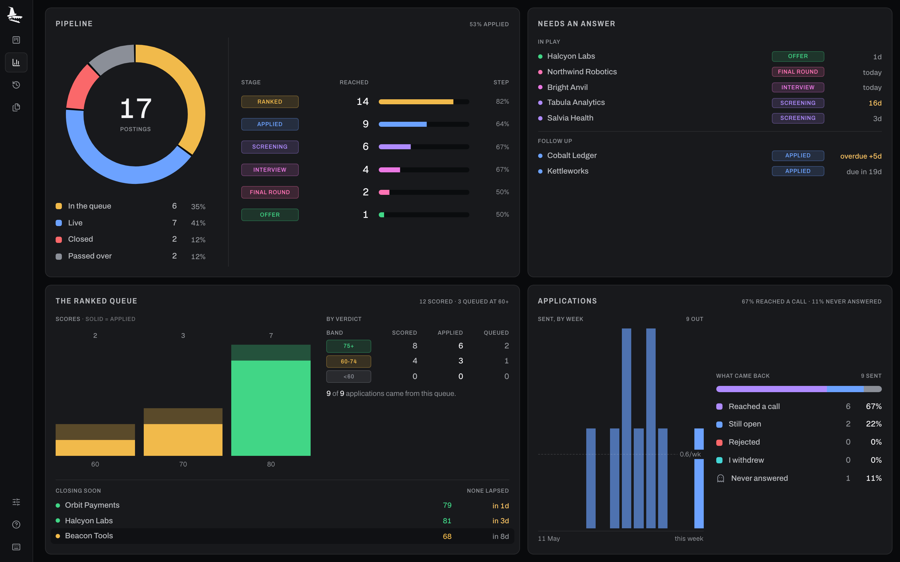
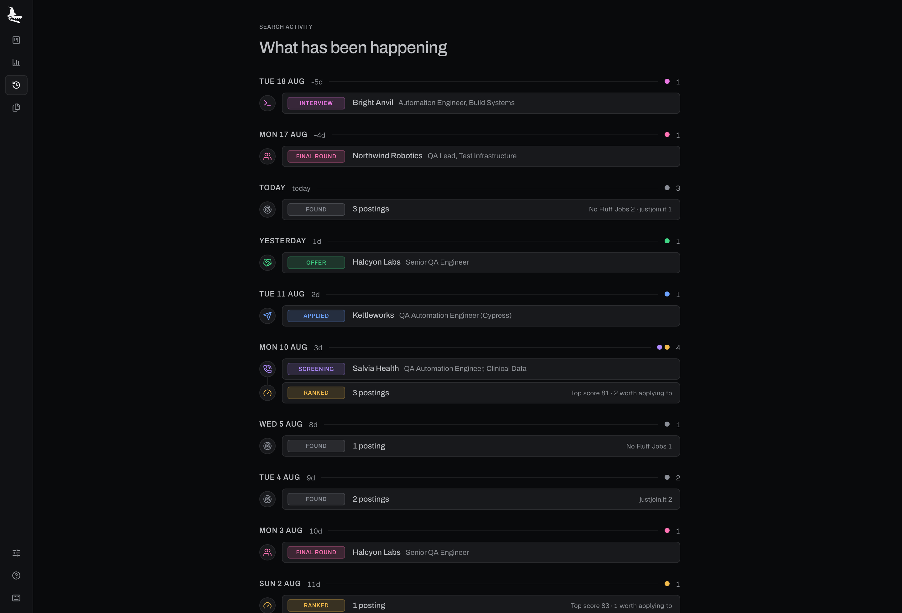

# Croc the Job

<p align="center">
  
</p>

<p align="center">
  <strong>A job-hunt tracker: scrape postings, score them against your profile, draft the CV, and keep a record of every application.</strong><br>
  <em>Local-first. Open source.</em>
</p>

<p align="center">
  <a href="https://claude.com/claude-code"></a>
</p>

---

<p align="center">
  
</p>

<p align="center"><strong>Scrape · Rank · Tailor · Track · Prep</strong></p>

<p align="center">
  
  
  
  
  
  <br>
  <a href="CHANGELOG.md"></a>
  <a href="https://github.com/fn-jakubkarp/crocthejob/actions/workflows/ci.yml"></a>
  
  <a href="LICENSE"></a>
  
</p>

It is a tracker for job hunting, the way Jira or Notion is a tracker for work: scrape postings, evaluate them, keep a record of what you applied to and what happened. It does not automate applying.

The skills scrape the portals, score what came back against your profile, and draft a CV that only says things you can defend. The board is where you drag a card from **applied** to **screening** and the JSON updates underneath.

> [!NOTE]
> Every document it writes is assembled out of `documents/` and nothing else. It will not invent a skill you did not list or a number you did not give it. A thin profile produces a generic CV, and no amount of prompting fixes that.

## Installation

```bash
git clone https://github.com/fn-jakubkarp/crocthejob.git
cd crocthejob
bun install
```

Prerequisites, verifying the install, and filling in your documents: see [SETUP.md](SETUP.md).

## Usage

Open Claude Code **inside the repo** and run the skills. The loop is: profile once, then scrape, rank, apply, record.

```
/setup                                  # turn documents/ into your profile
/scrape                                 # search every installed portal, dedupe
/rank                                   # score what came back, shortlist it
/apply <url or pasted posting text>     # evaluate, draft, review, revise, verify
/outcome                                # record what happened
```

### Commands

| Command | What it does |
| --- | --- |
| `/setup` | Builds your profile from `documents/`. |
| `/expand` | Enriches the profile from sources you've linked. |
| `/reset` | Wipes profile data or documents. |
| `/scrape` | Searches every portal, dedupes, saves posting text. |
| `/rank` | Scores new postings, vetoes deal-breakers, shortlists. |
| `/add-portal` | Scaffolds a search skill for a new job board. |
| `/apply {url\|text}` | Drafts, reviews and verifies a tailored CV. |
| `/outcome` | Records what happened, archives the CV. |
| `/interview {company}` | Builds a stage-specific prep pack. |
| `/upskill` | Maps skill gaps against tracked postings. |

Full flags and behavior: [COMMANDS.md](COMMANDS.md).

## The board

```bash
bun run dev        # http://localhost:5173
```

Drag a card and the entry's `status` is rewritten in `data/jobs.json`. Notes typed on a card save to the same entry. Five sections: the board, stats, a history timeline, a markdown docs reader, and a page per posting whose run panel drives the same Claude Code install your terminal does.

<p align="center">
  
</p>
<p align="center"><sub><strong>A page per posting</strong> · the stage rail, the score breakdown, the log as a timeline, and every document written for it</sub></p>

<p align="center">
  
</p>
<p align="center"><sub><strong>Stats</strong> · where the funnel leaks, what is overdue a chase, and what the ranking actually converted</sub></p>

<p align="center">
  
</p>
<p align="center"><sub><strong>History</strong> · reconstructed from the dates in the file, one line per action rather than per row written</sub></p>

> [!WARNING]
> It runs under `bun run dev` only. The write path is a Vite dev-server plugin, so `bun run build` produces a bundle that loads nothing and saves nothing. This is a local tool, not a deployment.

The data file does not have to live in the repo. `studio/packages/jobs-data/store.ts` checks `JOBS_FILE`, then `../data/jobs.json` next to `studio/`, then `studio/data/jobs.json`, first hit wins.

```bash
JOBS_FILE=~/jobs.json bun run dev
```

## How it works

**One file, two halves.** `data/jobs.json` is keyed by posting URL. `/scrape` appends, `/rank` scores into it, the board moves cards around it, `/outcome` closes them out. There is no database and no sync, which is why the board and the skills never disagree about what happened.

**Field ownership is explicit.** Six fields belong to the board alone (`id`, `next_id`, `status_date`, `applied_date`, `duplicate_of`, `outcome`), and the skills are told to carry them through untouched. `studio/packages/jobs-data/` is the only code that opens the file, so the schema has one definition rather than four.

**Statuses are a pipeline, outcomes are a description.**

```
new → ranked → applied → screening → tech_interview → final_round → offer
                                                    ↘ rejected · skipped
```

`outcome` is a combinable array, not a single value. Going quiet after the technical interview is `["ghosted", "failed_tech"]`, which three separate status columns could never have said.

**Nothing is fabricated.** Three sources ground every draft: `01-candidate-profile.md`, the master CV, and the profile block in `CLAUDE.md`. A claim supported by none of them is removed before the file is written, which is also why a fact you confirm in conversation gets written back to the profile in the same turn.

## Repo layout

```
crocthejob/
├── CLAUDE.md                      # your profile + the workflow rules (template until /setup)
├── AGENTS.md                      # thin pointer for non-Claude agent runtimes
├── data/jobs.json                 # every posting seen, every application made
├── .claude/
│   ├── commands/                  # the ten slash commands above
│   ├── skills/
│   │   ├── job-application-assistant/   # profile, writing style, evaluation, CV rules, interview prep
│   │   ├── job-scraper/                 # /scrape orchestration + your search queries
│   │   └── upskill/
│   └── settings.json              # the pre-approved permission allowlist
├── .agents/skills/                # portal search CLIs (Bun, one SKILL.md each)
├── documents/                     # your CV, LinkedIn, references, applications + templates/
├── studio/                        # the web app and the code it shares
│   ├── apps/web/                  # board, stats, history, docs, job page (Vite + React)
│   ├── packages/jobs-data/        # the schema, and the only code that opens jobs.json
│   └── brand/                     # the marks
├── tools/                         # lint_skills.py, security_guards.py, verify_pdf.py
└── tests/
```

## Contributing

Issues and PRs welcome. Run the checks in [SETUP.md](SETUP.md) before opening one.

Market-specific portal skills belong in your own fork rather than here, which is what `/add-portal` is for. Improvements to the generator itself are very welcome.

## Credits

Forked from [MadsLorentzen/ai-job-search](https://github.com/MadsLorentzen/ai-job-search) (MIT), then rewritten: Polish-market portals, a web app, one data file instead of two, a markdown CV pipeline, and its own opinions about what a job search needs. The portal-CLI pattern traces back to [Mikkel Krogholm](https://github.com/mikkelkrogsholm)'s [skills repo](https://github.com/mikkelkrogsholm/skills).

Built with [Claude Code](https://claude.com/claude-code).

## License

MIT. See [LICENSE](LICENSE).
